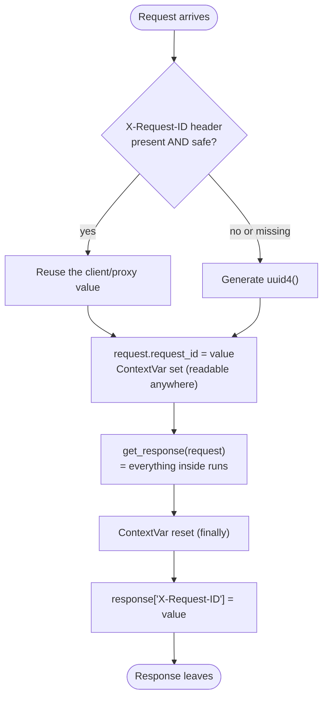
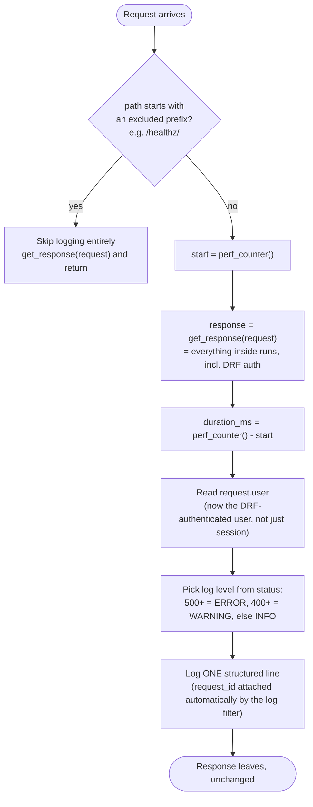
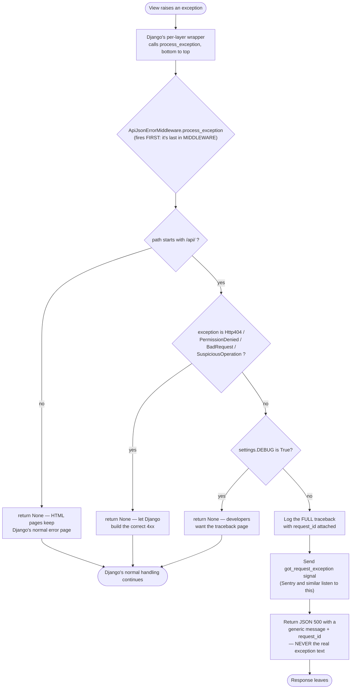
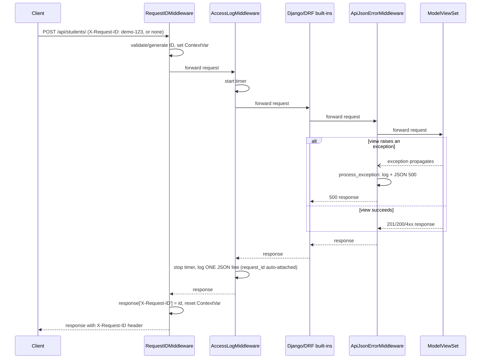

# Custom Middleware for DRF, Step by Step (Pictorial)

A visual, step-by-step guide to the three production middleware built for the `Student` DRF project — `RequestIDMiddleware`, `AccessLogMiddleware`, `ApiJsonErrorMiddleware` — plus a set of other custom middleware that matter in real production APIs.

## Contents

1. [Where these three fit in the stack](#1-where-these-three-fit-in-the-stack)
2. [RequestIDMiddleware](#2-requestidmiddleware)
3. [AccessLogMiddleware](#3-accesslogmiddleware)
4. [ApiJsonErrorMiddleware](#4-apijsonerrormiddleware)
5. [How the three work together on one request](#5-how-the-three-work-together-on-one-request)
6. [Other production-important custom middleware](#6-other-production-important-custom-middleware)
7. [Full settings.py wiring](#7-full-settingspy-wiring)
8. [Checklist](#8-checklist)

---

## 1. Where these three fit in the stack

```
                         ┌─────────────────────────────────────────────┐
                         │            RequestIDMiddleware               │  1st: wraps EVERYTHING
                         │  ┌─────────────────────────────────────────┐│
                         │  │          AccessLogMiddleware            ││  2nd: times everything below
                         │  │  ┌───────────────────────────────────┐  ││
                         │  │  │   SecurityMiddleware               │  ││
                         │  │  │   SessionMiddleware                │  ││
                         │  │  │   CommonMiddleware                  │  ││   Django + DRF built-ins
                         │  │  │   CsrfViewMiddleware                │  ││
                         │  │  │   AuthenticationMiddleware          │  ││
                         │  │  │   MessageMiddleware                 │  ││
                         │  │  │   XFrameOptionsMiddleware           │  ││
                         │  │  │  ┌───────────────────────────────┐ │  ││
                         │  │  │  │   ApiJsonErrorMiddleware       │ │  ││  LAST: catches crashes first
                         │  │  │  │  ┌───────────────────────────┐│ │  ││       (process_exception
                         │  │  │  │  │  URL router ▶ ModelViewSet ││ │  ││        runs bottom ▶ top)
                         │  │  │  │  └───────────────────────────┘│ │  ││
                         │  │  │  └───────────────────────────────┘ │  ││
                         │  │  └───────────────────────────────────┘  ││
                         │  └─────────────────────────────────────────┘│
                         └─────────────────────────────────────────────┘
```

| Middleware | Position | Why there |
|---|---|---|
| `RequestIDMiddleware` | **First** | Every response, even a 301 or 403 from a layer above, must carry the same ID |
| `AccessLogMiddleware` | **Second** | Must see the *final* status code and timing of everything beneath it |
| `ApiJsonErrorMiddleware` | **Last** | `process_exception` hooks fire bottom-to-top, so "last in the list" means "first to see the crash" |

---

## 2. RequestIDMiddleware

### What problem it solves

```
 WITHOUT a request ID                              WITH a request ID
 ─────────────────────                             ───────────────────

 nginx log:    "POST /api/students/ 500"           nginx log:    "... rid=3f6c1b9e ..."
 gunicorn log: "worker crashed"                     gunicorn log: "... rid=3f6c1b9e ..."
 django log:   "IntegrityError at ..."              django log:   "... rid=3f6c1b9e ..."

      ✗ Three unrelated-looking lines.                  ✓ Search "3f6c1b9e" ▶ every line
        Which crash goes with which request?               for THIS request, across every log.
```

### Step by step



1. **Look at the incoming header.** If the client or a proxy already sent `X-Request-ID`, and it matches a safe pattern, reuse it — that lets one ID follow a request from nginx into your app.
2. **Reject anything unsafe.** A raw value could contain newlines or JSON-breaking characters (log injection), so anything that fails the regex is thrown away and replaced.
3. **Generate a UUID4 as the fallback.** Random, unguessable, always safe.
4. **Store it twice**: on `request.request_id` (for view code) and in a `ContextVar` (for code with no `request`, like a serializer or a Celery task).
5. **`try/finally`** guarantees the `ContextVar` is reset even if the view crashes, so the ID never leaks into the next request handled by the same thread.
6. **Add the header after `get_response`**, so it decorates every response, including ones produced by layers above it that short-circuited.

### Code (`core/middleware.py`)

```python
import re
import uuid
from django.conf import settings
from .context import reset_request_id, set_request_id

# Only accept "safe" incoming IDs: stops log injection (newlines, JSON breakers, huge values)
_SAFE_REQUEST_ID = re.compile(r"[a-zA-Z0-9_.\-]{1,64}")


class RequestIDMiddleware:
    def __init__(self, get_response):
        self.get_response = get_response
        self.header = getattr(settings, "REQUEST_ID_HEADER", "X-Request-ID")
        self.meta_key = "HTTP_" + self.header.upper().replace("-", "_")

    def __call__(self, request):
        incoming = request.META.get(self.meta_key, "")
        request_id = incoming if _SAFE_REQUEST_ID.fullmatch(incoming) else str(uuid.uuid4())

        request.request_id = request_id
        token = set_request_id(request_id)
        try:
            response = self.get_response(request)
        finally:
            reset_request_id(token)

        response[self.header] = request_id
        return response
```

```python
# core/context.py
from contextvars import ContextVar

_request_id: ContextVar[str] = ContextVar("request_id", default="-")

def set_request_id(value: str):
    return _request_id.set(value)

def reset_request_id(token) -> None:
    _request_id.reset(token)

def get_request_id() -> str:
    return _request_id.get()
```

### Verify it

```bash
curl -i http://127.0.0.1:8000/api/students/                                   # generated uuid4
curl -i -H "X-Request-ID: demo-123" http://127.0.0.1:8000/api/students/        # reused "demo-123"
curl -i -H "X-Request-ID: bad;id\$(whoami)" http://127.0.0.1:8000/api/students/  # replaced, not reused
```

---

## 3. AccessLogMiddleware

### What problem it solves

```
 Django's default dev server log:          A structured access log:
 "GET /api/students/ HTTP/1.1" 200 512     {"http_method":"GET","http_path":"/api/students/",
                                             "status_code":200,"duration_ms":12.4,
      ✗ plain text, not searchable           "user_id":7,"client_ip":"203.0.113.7",
      ✗ no user, no duration                 "request_id":"3f6c1b9e..."}
      ✗ query strings may leak tokens
                                             ✓ one JSON object per line
                                             ✓ filterable, alertable, joins with request_id
```

### Step by step



1. **Skip excluded paths first**, like `/healthz/`, so load-balancer pings every few seconds don't drown real traffic in your logs.
2. **Start a monotonic timer** before calling `get_response`, so it measures everything below it: Django's built-ins, DRF authentication, permissions, the view.
3. **Read `request.user` only *after* `get_response`.** DRF authenticates *inside* the view and writes the result back onto the Django request, so reading it earlier would give you the wrong (or no) user.
4. **Never log the body, query string, or `Authorization` header.** Those can carry passwords and tokens — this middleware only logs the path, method, status, duration, user id, and client IP.
5. **Pick the log level from the status code**, so "alert on any ERROR from this logger" becomes a one-line monitoring rule.
6. **The `request_id` field appears automatically** — it isn't added here. A logging `Filter` (`RequestIDFilter`, shown below) stamps it onto every log record from the `ContextVar` that `RequestIDMiddleware` set.

### Code (`core/middleware.py`, continued)

```python
import logging
import time

access_logger = logging.getLogger("app.access")


def get_client_ip(request, trusted_proxies: int) -> str:
    """
    Behind N trusted proxies the real client is the N-th entry from the END of X-Forwarded-For.
    Entries further left are client-controlled and can be spoofed.
    """
    remote = request.META.get("REMOTE_ADDR", "")
    if trusted_proxies <= 0:
        return remote                                   # not behind a proxy: ignore the header entirely
    parts = [p.strip() for p in request.META.get("HTTP_X_FORWARDED_FOR", "").split(",") if p.strip()]
    return parts[-trusted_proxies] if len(parts) >= trusted_proxies else remote


class AccessLogMiddleware:
    def __init__(self, get_response):
        self.get_response = get_response
        self.exclude = tuple(getattr(settings, "ACCESS_LOG_EXCLUDE_PATHS", ("/healthz/",)))
        self.trusted_proxies = getattr(settings, "TRUSTED_PROXY_COUNT", 0)

    def __call__(self, request):
        if request.path.startswith(self.exclude):
            return self.get_response(request)

        start = time.perf_counter()
        response = self.get_response(request)
        duration_ms = round((time.perf_counter() - start) * 1000, 1)

        user = getattr(request, "user", None)
        user_id = user.pk if getattr(user, "is_authenticated", False) else None
        status = response.status_code
        level = logging.ERROR if status >= 500 else logging.WARNING if status >= 400 else logging.INFO

        access_logger.log(
            level, "%s %s -> %s", request.method, request.path, status,
            extra={
                "http_method": request.method,
                "http_path": request.path,
                "status_code": status,
                "duration_ms": duration_ms,
                "user_id": user_id,
                "client_ip": get_client_ip(request, self.trusted_proxies),
            },
        )
        return response
```

### The logging plumbing it relies on (`core/logging.py`)

```python
import json
import logging
from datetime import datetime, timezone
from .context import get_request_id

_STANDARD_ATTRS = set(logging.LogRecord("", 0, "", 0, "", (), None).__dict__) | {"message", "asctime"}


class RequestIDFilter(logging.Filter):
    """Stamp every log record with the current request id, read from the ContextVar."""
    def filter(self, record):
        record.request_id = get_request_id()
        return True


class JSONFormatter(logging.Formatter):
    """One JSON object per line."""
    def format(self, record):
        payload = {
            "ts": datetime.fromtimestamp(record.created, tz=timezone.utc).isoformat(timespec="milliseconds"),
            "level": record.levelname,
            "logger": record.name,
            "message": record.getMessage(),
        }
        for key, value in record.__dict__.items():
            if key not in _STANDARD_ATTRS:
                payload[key] = value
        if record.exc_info:
            payload["exc"] = self.formatException(record.exc_info)
        return json.dumps(payload, default=str)
```

```python
# settings.py
LOGGING = {
    "version": 1,
    "disable_existing_loggers": False,
    "filters": {"request_id": {"()": "core.logging.RequestIDFilter"}},
    "formatters": {"json": {"()": "core.logging.JSONFormatter"}},
    "handlers": {
        "console": {"class": "logging.StreamHandler", "formatter": "json", "filters": ["request_id"]},
    },
    "root": {"handlers": ["console"], "level": "INFO"},
}
```

### Verify it

```bash
curl -H "X-Request-ID: demo-123" http://127.0.0.1:8000/api/students/
```
```json
{"ts":"...","level":"INFO","logger":"app.access","message":"GET /api/students/ -> 200",
 "http_method":"GET","http_path":"/api/students/","status_code":200,
 "duration_ms":8.1,"user_id":null,"client_ip":"127.0.0.1","request_id":"demo-123"}
```

---

## 4. ApiJsonErrorMiddleware

### What problem it solves

```
 An unhandled bug in a view, WITHOUT this middleware:

    Client ◀── 500 ── <html><body> ... Traceback (most recent call last) ...
                        File "/app/students/views.py", line 42, in list
                        IntegrityError: duplicate key value violates ...  </body></html>

    ✗ Leaks file paths, DB schema, library versions to the client
    ✗ HTML, not JSON — breaks every API client's error parsing


 WITH this middleware:

    Client ◀── 500 ── {"error":{"status":500,"code":"server_error",
                                 "message":"Internal server error."},
                        "request_id":"3f6c1b9e..."}

    Server log ── ERROR  Unhandled exception in API view  [full traceback]  request_id=3f6c1b9e...
```

### Step by step



1. **Only `process_exception` matters here.** `__call__` just forwards, because this middleware has nothing to do on the normal path — it only acts when the view *crashes*.
2. **Being last in `MIDDLEWARE` puts it first for exceptions.** Exception hooks run bottom-to-top, mirroring the response phase (lesson 1's onion).
3. **Only touch `/api/` paths.** Django admin and any HTML views should keep Django's own error pages.
4. **Pass through exceptions Django already handles well** (`Http404`, `PermissionDenied`, `BadRequest`, `SuspiciousOperation`) — returning `None` means "not mine, let the normal machinery build the response".
5. **Skip it entirely in `DEBUG`,** so you still see the full traceback page while developing.
6. **Log the real exception yourself**, with `exc_info=exception`, because returning a response from `process_exception` stops Django from logging or notifying error trackers on its own.
7. **Fire `got_request_exception`** so tools like Sentry, which listen for that signal, still hear about the crash even though you intercepted it.
8. **Never put the exception text in the client response.** A generic message plus the `request_id` is enough — anyone debugging looks the ID up in the logs.

### Code (`core/middleware.py`, continued)

```python
from django.core.exceptions import BadRequest, PermissionDenied, SuspiciousOperation
from django.core.signals import got_request_exception
from django.http import Http404, JsonResponse

error_logger = logging.getLogger("app.errors")

# Exceptions Django already maps to proper 4xx responses: leave them alone
_PASS_THROUGH = (Http404, PermissionDenied, BadRequest, SuspiciousOperation)


class ApiJsonErrorMiddleware:
    api_prefix = "/api/"

    def __init__(self, get_response):
        self.get_response = get_response

    def __call__(self, request):
        return self.get_response(request)

    def process_exception(self, request, exception):
        if not request.path.startswith(self.api_prefix):
            return None
        if isinstance(exception, _PASS_THROUGH):
            return None
        if settings.DEBUG:
            return None

        error_logger.error(
            "Unhandled exception in API view",
            exc_info=exception,
            extra={"http_method": request.method, "http_path": request.path},
        )
        got_request_exception.send(sender=self.__class__, request=request)

        return JsonResponse(
            {
                "error": {"status": 500, "code": "server_error", "message": "Internal server error."},
                "request_id": getattr(request, "request_id", None),
            },
            status=500,
        )
```

### Verify it

```python
# temporarily, in a view
def list(self, request, *args, **kwargs):
    raise RuntimeError("secret db detail")
```

```bash
DJANGO_DEBUG=0 python manage.py runserver
curl -s http://127.0.0.1:8000/api/students/
# {"error":{"status":500,"code":"server_error","message":"Internal server error."},"request_id":"..."}
```
Server console shows the real `RuntimeError` traceback with the same `request_id`. Then revert the view.

---

## 5. How the three work together on one request



**The single fact that ties all three together:** `RequestIDMiddleware` sets a `ContextVar`. `AccessLogMiddleware` never touches that `ContextVar` directly — the `RequestIDFilter` in `core/logging.py` reads it automatically for *every* log line, including the access log and the error log. That's why the same `request_id` shows up in both without either middleware knowing about the other.

---

## 6. Other production-important custom middleware

These aren't part of the `Student` lessons yet, but they show up in most real DRF deployments. Each includes working code.

### 6.1 `MaintenanceModeMiddleware`

**Problem:** during a deploy or migration, you want the API to return a clean 503 instead of half-working or throwing DB errors.

```
      MAINTENANCE_MODE = True in settings/env
             │
   Request ──▶ MaintenanceModeMiddleware ──▶ 503 {"error": "Service temporarily unavailable"}
             │        (skips /healthz/)
             ▼
        everything below NEVER RUNS
```

```python
from django.http import JsonResponse
from django.conf import settings

class MaintenanceModeMiddleware:
    def __init__(self, get_response):
        self.get_response = get_response
        self.exempt = tuple(getattr(settings, "MAINTENANCE_EXEMPT_PATHS", ("/healthz/", "/admin/")))

    def __call__(self, request):
        if getattr(settings, "MAINTENANCE_MODE", False) and not request.path.startswith(self.exempt):
            return JsonResponse(
                {"error": {"status": 503, "code": "maintenance", "message": "Service temporarily unavailable."}},
                status=503,
            )
        return self.get_response(request)
```

Place it **first**, even before `RequestIDMiddleware`, so it short-circuits before any other work happens. Flip `MAINTENANCE_MODE` via an environment variable so you don't need a deploy to toggle it.

### 6.2 `RequestSizeLimitMiddleware`

**Problem:** a client (or attacker) sends a huge JSON body and ties up a worker parsing and validating it.

```
   Content-Length: 50000000  (50 MB)
             │
   Request ──▶ RequestSizeLimitMiddleware ──▶ 413 Payload Too Large
             │        (checked BEFORE the body is read)
             ▼
        body never reaches DRF's parser
```

```python
from django.http import JsonResponse

class RequestSizeLimitMiddleware:
    def __init__(self, get_response, max_bytes=5 * 1024 * 1024):   # 5 MB default
        self.get_response = get_response
        self.max_bytes = max_bytes

    def __call__(self, request):
        length = request.META.get("CONTENT_LENGTH")
        if length and length.isdigit() and int(length) > self.max_bytes:
            return JsonResponse(
                {"error": {"status": 413, "code": "payload_too_large",
                           "message": f"Request body exceeds {self.max_bytes} bytes."}},
                status=413,
            )
        return self.get_response(request)
```

Checking `Content-Length` is cheap because it rejects **before** Django reads the body into memory. A client that lies about `Content-Length` isn't fully stopped by this alone — pair it with a hard limit at the proxy (`client_max_body_size` in nginx).

### 6.3 `IdempotencyKeyMiddleware`

**Problem:** a client's POST times out, it retries, and you end up creating the student twice. This is common for payment-like or create-once APIs.

```
   Client sends: Idempotency-Key: 7e21c9

   1st attempt:  POST /api/students/  ──▶ 201 Created  ── cached: 7e21c9 -> 201 response, 10 min TTL
   (network drops, client never sees the response)

   2nd attempt:  POST /api/students/  (same key) ──▶ cache hit ──▶ replay the SAME 201, no new row created
```

```python
import hashlib
import json
from django.core.cache import cache
from django.http import JsonResponse

class IdempotencyKeyMiddleware:
    header = "HTTP_IDEMPOTENCY_KEY"
    ttl_seconds = 600

    def __init__(self, get_response):
        self.get_response = get_response

    def __call__(self, request):
        if request.method != "POST":
            return self.get_response(request)

        key = request.META.get(self.header)
        if not key:
            return self.get_response(request)          # idempotency is opt-in for the client

        cache_key = f"idem:{request.path}:{hashlib.sha256(key.encode()).hexdigest()}"
        cached = cache.get(cache_key)
        if cached:
            return JsonResponse(cached["body"], status=cached["status"])

        response = self.get_response(request)
        if 200 <= response.status_code < 300 and hasattr(response, "data"):
            cache.set(cache_key, {"status": response.status_code, "body": response.data}, self.ttl_seconds)
        return response
```

Place it **after** authentication (so the cache key can't be guessed and replayed by a different user) but before the view. Requires a real cache backend (Redis) in production — the default local-memory cache won't share state across gunicorn workers.

### 6.4 `SlowRequestWarningMiddleware`

**Problem:** you want a loud warning for any request that's unusually slow, separate from the routine access log.

```
   duration_ms > SLOW_REQUEST_THRESHOLD_MS
             │
             ▼
   logger.warning("slow_request", extra={...})  ──▶ triggers your alerting rule
```

```python
import logging
import time
from django.conf import settings

slow_logger = logging.getLogger("app.slow_requests")

class SlowRequestWarningMiddleware:
    def __init__(self, get_response):
        self.get_response = get_response
        self.threshold_ms = getattr(settings, "SLOW_REQUEST_THRESHOLD_MS", 1000)

    def __call__(self, request):
        start = time.perf_counter()
        response = self.get_response(request)
        duration_ms = (time.perf_counter() - start) * 1000
        if duration_ms > self.threshold_ms:
            slow_logger.warning(
                "slow_request",
                extra={"http_path": request.path, "duration_ms": round(duration_ms, 1),
                       "threshold_ms": self.threshold_ms},
            )
        return response
```

This can live right next to `AccessLogMiddleware`, or you can fold its logic into it. Kept separate here because you may want a different alert threshold per environment without touching your main access log.

### 6.5 CORS: use a battle-tested package, not a hand-rolled one

**Problem:** a frontend on a different origin (`app.school.com` calling `api.school.com`) needs `Access-Control-Allow-Origin` and correct preflight (`OPTIONS`) handling.

```
   Browser preflight:  OPTIONS /api/students/  Origin: https://app.school.com
                                 │
                                 ▼
   corsheaders.middleware.CorsMiddleware
                                 │
              is app.school.com in CORS_ALLOWED_ORIGINS?
                     │ yes                      │ no
                     ▼                           ▼
      Access-Control-Allow-Origin: ...      no CORS headers ▶ browser blocks the response
```

```bash
pip install django-cors-headers
```

```python
# settings.py
INSTALLED_APPS += ["corsheaders"]

MIDDLEWARE = [
    "corsheaders.middleware.CorsMiddleware",       # must be ABOVE CommonMiddleware
    "core.middleware.RequestIDMiddleware",
    "core.middleware.AccessLogMiddleware",
    "django.middleware.security.SecurityMiddleware",
    "django.contrib.sessions.middleware.SessionMiddleware",
    "django.middleware.common.CommonMiddleware",
    ...
]

CORS_ALLOWED_ORIGINS = ["https://app.school.com"]
CORS_ALLOW_CREDENTIALS = True     # only if you actually use cookies cross-origin
```

CORS handling has many small, security-relevant edge cases (preflight caching, credentialed requests, wildcard origins). `django-cors-headers` is maintained and tested for exactly this — writing your own is a common source of subtle security holes, so it's listed here as "don't write it yourself" rather than as sample code.

### 6.6 Where they all fit

```
MaintenanceModeMiddleware        first of all: short-circuits during deploys
CorsMiddleware                   before Common, so preflight OPTIONS never hits the slash-redirect logic
RequestIDMiddleware              wraps everything that remains
AccessLogMiddleware              times everything below it
SlowRequestWarningMiddleware     can sit next to AccessLogMiddleware
RequestSizeLimitMiddleware       before the body is ever read
Security / Session / Common / Csrf / Auth / Messages / XFrame     (Django built-ins)
IdempotencyKeyMiddleware         after Auth, so the cache key is tied to a real user
ApiJsonErrorMiddleware           last: catches crashes first
```

---

## 7. Full settings.py wiring

```python
MIDDLEWARE = [
    "core.middleware.MaintenanceModeMiddleware",
    "corsheaders.middleware.CorsMiddleware",
    "core.middleware.RequestIDMiddleware",
    "core.middleware.AccessLogMiddleware",
    "core.middleware.SlowRequestWarningMiddleware",
    "core.middleware.RequestSizeLimitMiddleware",
    "django.middleware.security.SecurityMiddleware",
    "django.contrib.sessions.middleware.SessionMiddleware",
    "django.middleware.common.CommonMiddleware",
    "django.middleware.csrf.CsrfViewMiddleware",
    "django.contrib.auth.middleware.AuthenticationMiddleware",
    "django.contrib.messages.middleware.MessageMiddleware",
    "django.middleware.clickjacking.XFrameOptionsMiddleware",
    "core.middleware.IdempotencyKeyMiddleware",
    "core.middleware.ApiJsonErrorMiddleware",
]

REQUEST_ID_HEADER = "X-Request-ID"
ACCESS_LOG_EXCLUDE_PATHS = ("/healthz/",)
TRUSTED_PROXY_COUNT = 0
SLOW_REQUEST_THRESHOLD_MS = 1000
MAINTENANCE_MODE = False
MAINTENANCE_EXEMPT_PATHS = ("/healthz/", "/admin/")
```

Run `python manage.py check` after every change — it instantiates each middleware and will surface a broken `__init__`/`__call__` immediately, before you hit an endpoint.

---

## 8. Checklist

| Middleware | Solves | Position | Needs |
|---|---|---|---|
| `MaintenanceModeMiddleware` | Clean 503 during deploys | First of all | Env flag |
| `CorsMiddleware` (package) | Cross-origin frontend calls | Above `CommonMiddleware` | `django-cors-headers` |
| `RequestIDMiddleware` | Trace one request across every log | First custom layer | `core/context.py` |
| `AccessLogMiddleware` | One structured log line per request | Right after RequestID | `core/logging.py` + `LOGGING` |
| `SlowRequestWarningMiddleware` | Loud alert on slow requests | Near AccessLog | separate logger |
| `RequestSizeLimitMiddleware` | Reject oversized bodies early | Before Django's built-ins | — |
| `IdempotencyKeyMiddleware` | Safe POST retries | After Auth | Redis cache |
| `ApiJsonErrorMiddleware` | Clean JSON 500s, no leaks | **Last** | `got_request_exception` |

**Three rules to remember:**
1. Anything that must see *every* response goes near the top.
2. Anything that depends on `request.session` or `request.user` goes after `SessionMiddleware` / `AuthenticationMiddleware`.
3. Anything using `process_exception` should usually go **last**, since that hook runs bottom-to-top.