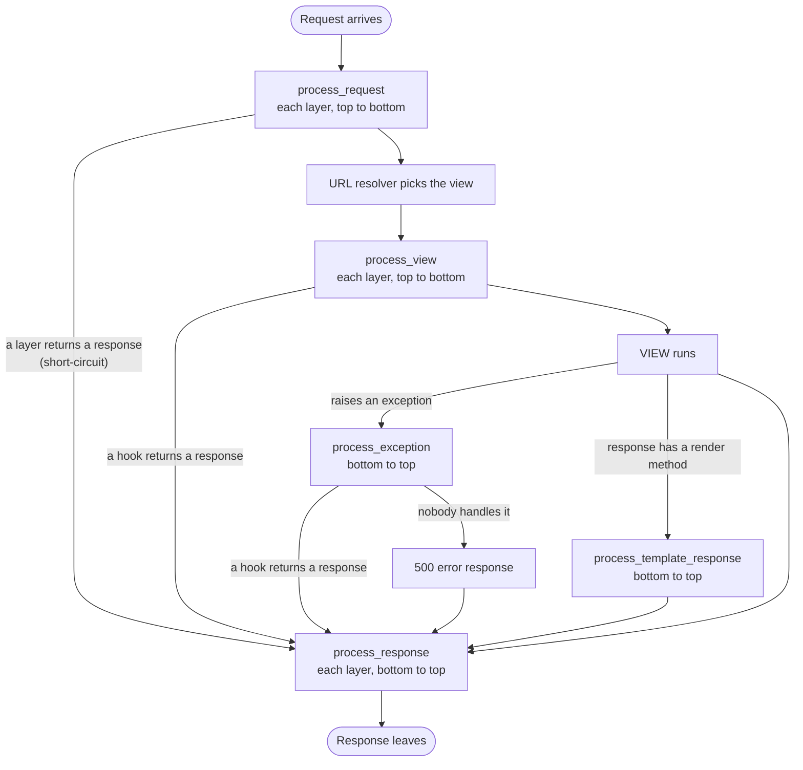
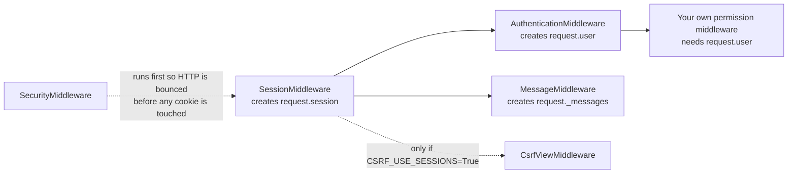
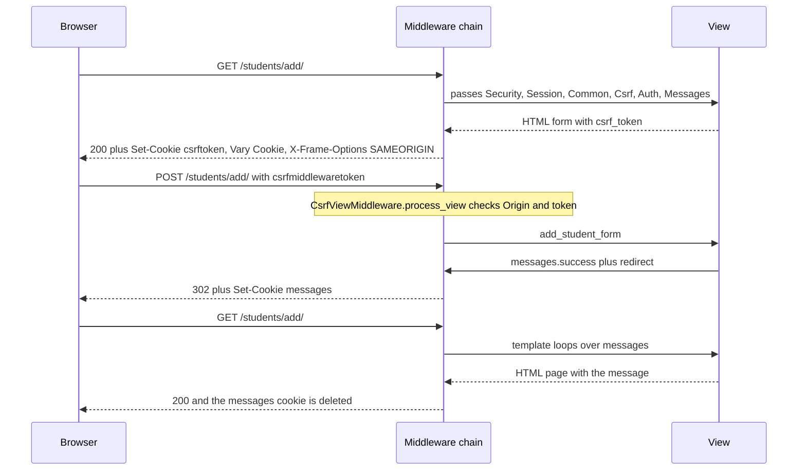

# Django Middleware Cheat Sheet, with Pictures

A visual summary of every middleware covered in the `Student` project: what each layer does, what it protects you from, and how the layers fit together.

> **How to read the pictures:** the ASCII diagrams display in any editor. The `mermaid` diagrams render on GitHub, GitLab, VS Code (Markdown preview), Obsidian and most Markdown tools. In a plain text viewer they show up as code.

## Contents

1. [The onion](#1-the-onion)
2. [Layer-by-layer stack](#2-layer-by-layer-stack)
3. [Request lifecycle and hooks](#3-request-lifecycle-and-hooks)
4. [Short-circuiting](#4-short-circuiting)
5. [Dependencies between layers](#5-dependencies-between-layers)
6. [Each built-in in pictures](#6-each-built-in-in-pictures)
7. [One request end to end](#7-one-request-end-to-end)
8. [Threat map](#8-threat-map)
9. [Custom middleware we wrote](#9-custom-middleware-we-wrote)
10. [Middleware vs DRF](#10-middleware-vs-drf)
11. [Settings quick reference](#11-settings-quick-reference)
12. [Common mistakes](#12-common-mistakes)
13. [Memory aid](#13-memory-aid)

---

## 1. The onion

Middleware wraps the view in layers. A request travels **inward** (top of `MIDDLEWARE` first), and the response travels back **outward** (last layer first).

```
┌────────────────────────────────────────────────────────────┐
│ timing_middleware                                          │
│ ┌────────────────────────────────────────────────────────┐ │
│ │ SecurityMiddleware                                     │ │
│ │ ┌────────────────────────────────────────────────────┐ │ │
│ │ │ SessionMiddleware                                  │ │ │
│ │ │ ┌────────────────────────────────────────────────┐ │ │ │
│ │ │ │ CommonMiddleware                               │ │ │ │
│ │ │ │ ┌────────────────────────────────────────────┐ │ │ │ │
│ │ │ │ │ CsrfViewMiddleware                         │ │ │ │ │
│ │ │ │ │ ┌────────────────────────────────────────┐ │ │ │ │ │
│ │ │ │ │ │ AuthenticationMiddleware               │ │ │ │ │ │
│ │ │ │ │ │ ┌────────────────────────────────────┐ │ │ │ │ │ │
│ │ │ │ │ │ │ MessageMiddleware                  │ │ │ │ │ │ │
│ │ │ │ │ │ │ ┌────────────────────────────────┐ │ │ │ │ │ │ │
│ │ │ │ │ │ │ │ XFrameOptionsMiddleware        │ │ │ │ │ │ │ │
│ │ │ │ │ │ │ │ ┌────────────────────────────┐ │ │ │ │ │ │ │ │
│ │ │ │ │ │ │ │ │ ApiKeyMiddleware           │ │ │ │ │ │ │ │ │
│ │ │ │ │ │ │ │ │ ┌────────────────────────┐ │ │ │ │ │ │ │ │ │
│ │ │ │ │ │ │ │ │ │  VIEW  (DRF ViewSet)   │ │ │ │ │ │ │ │ │ │
│ │ │ │ │ │ │ │ │ └────────────────────────┘ │ │ │ │ │ │ │ │ │
│ │ │ │ │ │ │ │ └────────────────────────────┘ │ │ │ │ │ │ │ │
│ │ │ │ │ │ │ └────────────────────────────────┘ │ │ │ │ │ │ │
│ │ │ │ │ │ └────────────────────────────────────┘ │ │ │ │ │ │
│ │ │ │ │ └────────────────────────────────────────┘ │ │ │ │ │
│ │ │ │ └────────────────────────────────────────────┘ │ │ │ │
│ │ │ └────────────────────────────────────────────────┘ │ │ │
│ │ └────────────────────────────────────────────────────┘ │ │
│ └────────────────────────────────────────────────────────┘ │
└────────────────────────────────────────────────────────────┘
```

```
   REQUEST  ───────────────▶  goes IN,  first item in MIDDLEWARE runs first
   RESPONSE ◀───────────────  comes OUT, last item in MIDDLEWARE runs first
```

**Why the first item is the outermost layer:** Django builds the chain by looping over `MIDDLEWARE` in **reverse**, wrapping each layer around the previous one.

```
handler = the view
for path in reversed(MIDDLEWARE):
    handler = MiddlewareClass(handler)     # each layer receives the next one as get_response
```

---

## 2. Layer-by-layer stack

What each layer does on the way in and on the way out:

```
┌────────────────────────────┬──────────────────────────────┬────────────────────────────────┐
│ Layer                      │ ▼ REQUEST (top to bottom)    │ ▲ RESPONSE (bottom to top)     │
├────────────────────────────┼──────────────────────────────┼────────────────────────────────┤
│ timing_middleware          │ start timer                  │ add X-Response-Time            │
├────────────────────────────┼──────────────────────────────┼────────────────────────────────┤
│ SecurityMiddleware         │ HTTP to HTTPS redirect       │ add HSTS, nosniff, Referrer    │
├────────────────────────────┼──────────────────────────────┼────────────────────────────────┤
│ SessionMiddleware          │ load request.session         │ save session, Set-Cookie       │
├────────────────────────────┼──────────────────────────────┼────────────────────────────────┤
│ CommonMiddleware           │ block bad UA, PREPEND_WWW    │ slash on 404, Content-Length   │
├────────────────────────────┼──────────────────────────────┼────────────────────────────────┤
│ CsrfViewMiddleware         │ load secret, check token     │ set csrftoken cookie           │
├────────────────────────────┼──────────────────────────────┼────────────────────────────────┤
│ AuthenticationMiddleware   │ lazy request.user            │ (nothing)                      │
├────────────────────────────┼──────────────────────────────┼────────────────────────────────┤
│ MessageMiddleware          │ attach message storage       │ store or clear messages        │
├────────────────────────────┼──────────────────────────────┼────────────────────────────────┤
│ XFrameOptionsMiddleware    │ (nothing)                    │ add X-Frame-Options            │
├────────────────────────────┼──────────────────────────────┼────────────────────────────────┤
│ ApiKeyMiddleware           │ 401 if X-API-Key is bad      │ (nothing)                      │
├────────────────────────────┼──────────────────────────────┼────────────────────────────────┤
│ VIEW / DRF action          │ run the action               │ return Response                │
└────────────────────────────┴──────────────────────────────┴────────────────────────────────┘
```

---

## 3. Request lifecycle and hooks

A middleware is a callable, and class-based ones may also define extra hooks. This is the order everything fires in:



| Hook | When | Return `None` | Return a response |
|---|---|---|---|
| `process_request` | Before URL resolution | Continue | Short-circuit |
| `process_view` | After resolution, before the view | Continue | Skip the view |
| `process_exception` | The view raised | Let others try | Use it as the response |
| `process_template_response` | View returned a renderable response | n/a | Must return a response |
| `process_response` | On the way out | n/a | Must return a response |

**Two ways to write a middleware:**

```python
# 1. Function style
def timing_middleware(get_response):          # runs once at startup
    def middleware(request):
        # before the view
        response = get_response(request)      # everything inside runs here
        # after the view
        return response
    return middleware

# 2. Class style (also allows the process_* hooks)
class MyMiddleware:
    def __init__(self, get_response):         # runs once at startup
        self.get_response = get_response
    def __call__(self, request):
        return self.get_response(request)
```

---

## 4. Short-circuiting

A layer can return a response **without** calling `get_response`. Everything below it is skipped, but layers **above** it still see the response on its way out.

```
 Good key                                          Bad key
 ────────                                          ───────
 Request                                           Request
   │                                                 │
   ▼                                                 ▼
 [timing]        start timer                       [timing]        start timer
   │                                                 │
   ▼                                                 ▼
 [Security]                                        [Security]
   │                                                 │
   ▼                                                 ▼
 [ ... ]                                           [ ... ]
   │                                                 │
   ▼                                                 ▼
 [ApiKey]  key OK ──▶ continue                     [ApiKey]  bad key ──▶ return 401 ─┐
   │                                                                                 │
   ▼                                                    ╳ layers below never run     │
 [VIEW]  200                                            ╳ the view never runs        │
   │                                                                                 │
   ▲ response climbs back up                            response climbs back up ◀────┘
 [timing]  adds X-Response-Time                    [timing]  still adds X-Response-Time
```

Real examples of short-circuits in the project:

| Layer | Short-circuits with |
|---|---|
| `SecurityMiddleware` | `301` redirect to HTTPS |
| `CommonMiddleware` | `403` for a blocked user agent, or a `www` redirect |
| `CsrfViewMiddleware` | `403` when the token is missing or wrong |
| `ApiKeyMiddleware` (ours) | `401` for a bad key |

---

## 5. Dependencies between layers

Some layers read what earlier layers create, so their **order is not arbitrary**.



On the way **out** the order flips, and that is why Messages must sit **below** Session:

```
 Response phase (bottom to top)

   MessageMiddleware   writes unread messages INTO request.session
          │
          ▼
   SessionMiddleware   then saves the session and sets the cookie
```

If Messages sat above Session, the session would already be saved and the messages would be lost.

---

## 6. Each built-in in pictures

### 6.1 SecurityMiddleware: transport and headers

```
 REQUEST PHASE                                         RESPONSE PHASE
 ─────────────                                         ──────────────

 Browser ── http://school.com/api/ ──▶ SecurityMiddleware
                                              │
              SECURE_SSL_REDIRECT=True        │                Every response gets:
              and not request.is_secure()     │                ┌────────────────────────────────────────┐
                                              ▼                │ Strict-Transport-Security  (HTTPS)     │
 Browser ◀── 301 Location: https://... ──────┘                │ X-Content-Type-Options: nosniff        │
                                                               │ Referrer-Policy: same-origin           │
                                                               │ Cross-Origin-Opener-Policy: same-origin│
                                                               └────────────────────────────────────────┘
```

- HSTS is only sent over HTTPS, and it is opt-in (`SECURE_HSTS_SECONDS`). Roll it out gradually: 5 min, 1 day, 30 days, 1 year.
- Behind a proxy set `SECURE_PROXY_SSL_HEADER`, or you get a **redirect loop**.
- Settings are read **once** in `__init__`.

### 6.2 SessionMiddleware: remembering a browser

```
 Browser                           Django                              Database
    │  Cookie: sessionid=abc123      │                                     │
    ├───────────────────────────────▶│ request.session = lazy object       │
    │                                │ (nothing loaded yet)                │
    │                                │                                     │
    │                                │ view reads request.session["x"] ───▶│ SELECT django_session
    │                                │◀──────────────────────────────────── │
    │                                │                                     │
    │  Set-Cookie: sessionid=abc123  │ view modified the session?          │
    │  Vary: Cookie                  │ ─ yes: save + Set-Cookie ──────────▶│ UPDATE
    │◀───────────────────────────────┤ ─ no:  do nothing                    │
```

- The session is **lazy**: no database hit until something touches it.
- Csrf (optionally), Auth and Messages all depend on it.

### 6.3 CommonMiddleware: URL housekeeping

```
 Client: GET /api/students            (no trailing slash)
    │
    ▼
 URL resolver ── no match ──▶ 404
                                │
                                ▼
                  CommonMiddleware.process_response
                  "does /api/students/ resolve?"
                                │ yes
                                ▼
 Client ◀── 301 Location: /api/students/ ──┘


 Client: POST /api/students           (no slash)
    ├─ DEBUG=True   ─▶ RuntimeError so you notice
    └─ DEBUG=False  ─▶ 301, and most clients retry as GET, so the POST body is LOST
```

| Job | Phase | Setting |
|---|---|---|
| Block bad user agents (403) | Request | `DISALLOWED_USER_AGENTS` (compiled regexes) |
| `example.com` to `www.example.com` | Request | `PREPEND_WWW` |
| Add missing slash (after a 404) | Response | `APPEND_SLASH` |
| Add `Content-Length` (non-streaming) | Response | automatic |

### 6.4 CsrfViewMiddleware: forged requests

**The attack, blocked:**

```
   evil.com                      Asha's browser                    school.com
      │                                 │                                │
      │  hidden auto-submit form        │                                │
      ├────────────────────────────────▶│                                │
      │                                 │ POST + sessionid cookie        │
      │                                 │ (attached automatically)       │
      │                                 ├───────────────────────────────▶│
      │                                 │                                │ cookie OK, but no CSRF token
      │                                 │◀────────── 403 Forbidden ──────┤ in the form or X-CSRFToken header
      │                                 │                                │
      ✗ attacker cannot READ the csrftoken cookie, so it cannot copy it into the request
```

**The token handshake (double-submit cookie):**

```
   GET form page                       POST form
   ─────────────                       ─────────
   Server ──▶ Set-Cookie: csrftoken=SECRET      Browser ──▶ Cookie: csrftoken=SECRET
          ──▶ <input name=csrfmiddlewaretoken            ──▶ csrfmiddlewaretoken=MASK+ENCRYPTED(SECRET)
               value=MASK+ENCRYPTED(SECRET)>
                                                Server: unmask token, compare with cookie secret
                                                        match     ─▶ accept
                                                        mismatch  ─▶ 403
```

| Fact | Detail |
|---|---|
| Checked methods | Everything except `GET`, `HEAD`, `OPTIONS`, `TRACE` |
| Where the check lives | `process_view`, because it needs the resolved view to read `csrf_exempt` |
| Token masking | Re-masked on every render (BREACH defence), the secret stays the same |
| Checked first | `Origin` (or `Referer` on HTTPS), then the token |
| DRF | Views are exempt, and `SessionAuthentication` re-adds the check **only** for cookie-authenticated users |

### 6.5 AuthenticationMiddleware: who is this?

```
 Request ──▶ AuthenticationMiddleware
                 │
                 │  request.user = SimpleLazyObject(get_user)      (no DB query yet)
                 ▼
             view touches request.user ──▶ read session ──▶ load User from the DB
                                           (only now)
```

- Needs `SessionMiddleware` above it.
- Has no response phase.
- Templates get `user` through the `auth` context processor.

### 6.6 MessageMiddleware: flash messages across redirects

```
   POST /students/add/                                   GET /students/add/  (after the redirect)
   ───────────────────                                   ─────────────────────────────────────────
   view: messages.success(request, "Added!")             template: 
   view: return redirect(...)                                         │
            │                                                         ▼ iterating CONSUMES them
            ▼                                            response: messages cookie deleted
   process_response: update()
   Set-Cookie: messages=<signed JSON>  ─── browser stores it ───▶ sent back automatically
```

What `update()` does at the end of each request:

| In this request | Result |
|---|---|
| Template **iterated** the messages | Storage cleared (consumed) |
| New message **added**, none read | Old unread + new are written back |
| Neither | Nothing touched, so unread messages **survive** |

```
 Storage:  FallbackStorage
   ┌───────────────┐  full (over 2048 bytes)   ┌──────────────────┐
   │ CookieStorage │ ────────────────────────▶ │  SessionStorage  │
   │ signed cookie │      overflow             │ request.session  │
   └───────────────┘                           └──────────────────┘
```

- The cookie is **signed**, not encrypted. Never put secrets in a message.
- `debug()` messages are dropped unless `MESSAGE_LEVEL` is lowered.
- For JSON APIs, return feedback in the response body instead.

### 6.7 XFrameOptionsMiddleware: clickjacking

```
   evil.com page
   ┌──────────────────────────────────────┐
   │   [ Win a free iPad! ]               │           Browser checks the frame's response:
   │   ┌────────────────────────────────┐ │
   │   │ INVISIBLE iframe               │ │           X-Frame-Options: DENY
   │   │ src = school.com/students/del  │ │                 │
   │   └────────────────────────────────┘ │                 ▼
   └──────────────────────────────────────┘           "Refused to display in a frame"
                                                       victim's click goes nowhere
```

| Value | Meaning |
|---|---|
| `DENY` (default) | Nobody can frame the page |
| `SAMEORIGIN` | Only your own origin can |
| *(no header)* via `@xframe_options_exempt` | Anyone can, so use only for public read-only pages |

- Response phase only. It never short-circuits.
- It is a **fallback**: a header set by the view or a decorator wins.
- For partner allow-lists use CSP `frame-ancestors`, since `ALLOW-FROM` is obsolete.

---

## 7. One request end to end

A teacher adds a student through the HTML form, then sees the confirmation.



The same request for the **API** (`POST /api/students/`) takes a slightly different path:

```
 Django middleware chain  ── all layers above, incl. ApiKeyMiddleware (401 if bad key)
        │
        ▼
 URL resolver  ──▶  router  ──▶  ViewSet.as_view({...})
        │
        ▼
 APIView.dispatch()
    ├─ initialize_request     wrap into DRF Request
    ├─ authentication         who are you?           (Session / Basic / Token)
    ├─ permissions            allowed?                (403 / 401)
    ├─ throttles              too many?               (429)
    ├─ create()               serializer.is_valid() ▶ save()
    └─ renderer               JSON or browsable API
        │
        ▼
 Middleware response phase (bottom to top)
```

---

## 8. Threat map

| | Threat | Layer that stops it |
|---|---|---|
| 🕵️ | Eavesdropping, downgrade from HTTPS to HTTP | `SecurityMiddleware` |
| 📝 | MIME sniffing, referrer leaks | `SecurityMiddleware` |
| 🎭 | Forged cross-site POST using a logged-in cookie | `CsrfViewMiddleware` |
| 🖼️ | Hidden iframe click-trick | `XFrameOptionsMiddleware` |
| 🍪 | "Remember this browser" | `SessionMiddleware` |
| 👤 | "Who is this user?" | `AuthenticationMiddleware` (needs Session) |
| 💬 | Feedback lost after a redirect | `MessageMiddleware` (needs Session) |
| 🔗 | Missing slash, bad bots, missing `Content-Length` | `CommonMiddleware` |
| ⏱️ | Slow requests, request tracing, custom API keys | Your own middleware |

---

## 9. Custom middleware we wrote

| Middleware | Style | Picture | Solves |
|---|---|---|---|
| `timing_middleware` | Function | `[start] ─ inner layers ─ [stop] ▶ X-Response-Time` | Basic performance visibility |
| `TraceMiddleware` (A, B) | Class | `A in ▶ B in ▶ VIEW ▶ B out ▶ A out` | Teaching the onion order |
| `ApiKeyMiddleware` | Class | `bad key ▶ 401, skip everything below` | Simple gate, short-circuit example |
| `StudentNotFoundMiddleware` | Class + `process_exception` | `DoesNotExist ▶ JSON 404` | Ugly 500 errors |
| `RequireHttpsForApiMiddleware` | Class | `http ▶ 400, https ▶ continue` | A redirect cannot un-leak a key already sent |
| `PerPathXFrameMiddleware` | Subclass | `/students/embed/ ▶ SAMEORIGIN, else DENY` | Per-request framing policy |
| `FrameAncestorsMiddleware` | Class | `add CSP frame-ancestors` | Allow-listing partner sites |

---

## 10. Middleware vs DRF

```
   ┌────────────────────────────────────────────────────────────┐
   │  MIDDLEWARE   sees EVERY request (HTML pages, admin, API)   │
   │  timing, HTTPS, headers, request IDs, sessions, CSRF        │
   │   ┌──────────────────────────────────────────────────────┐ │
   │   │  DRF   sees only API views                            │ │
   │   │  authentication, permissions, throttles, serializers  │ │
   │   │   ┌────────────────────────────────────────────────┐ │ │
   │   │   │  YOUR ACTION  list / create / retrieve ...      │ │ │
   │   │   └────────────────────────────────────────────────┘ │ │
   │   └──────────────────────────────────────────────────────┘ │
   └────────────────────────────────────────────────────────────┘
```

| Concern | Put it in |
|---|---|
| Applies to every response (headers, timing, HTTPS, request IDs) | **Middleware** |
| Who may do what on an API endpoint | **DRF permissions** |
| Rate limits per user or IP | **DRF throttles** |
| CSRF for cookie sessions | Middleware, with DRF views exempt and `SessionAuthentication` re-adding the check |
| Flash messages | HTML pages only, never APIs |

| Auth method | Cookie attached automatically? | CSRF enforced by DRF? |
|---|---|---|
| Session cookie | Yes | **Yes** |
| Token or JWT header | No | No |
| `X-API-Key` header | No | No |
| Basic auth | Browsers can cache it | No |

---

## 11. Settings quick reference

| Layer | Setting | Default | Note |
|---|---|---|---|
| Security | `SECURE_SSL_REDIRECT` | `False` | Turn on in production only |
| Security | `SECURE_HSTS_SECONDS` | `0` | Ramp up gradually |
| Security | `SECURE_PROXY_SSL_HEADER` | `None` | Needed behind a TLS-terminating proxy |
| Security | `SECURE_REFERRER_POLICY` | `"same-origin"` | |
| Session | `SESSION_COOKIE_SECURE` | `False` | `True` in production |
| Common | `APPEND_SLASH` | `True` | Only adds slashes, never removes |
| Common | `DISALLOWED_USER_AGENTS` | `[]` | Compiled regexes, not strings |
| Csrf | `CSRF_TRUSTED_ORIGINS` | `[]` | Must include the scheme (`https://...`) |
| Csrf | `CSRF_COOKIE_SECURE` | `False` | `True` in production |
| Csrf | `CSRF_COOKIE_HTTPONLY` | `False` | Keep `False` if JavaScript reads it |
| Messages | `MESSAGE_STORAGE` | `FallbackStorage` | Cookie first, then session |
| Messages | `MESSAGE_LEVEL` | `INFO` | `debug()` is dropped by default |
| XFrame | `X_FRAME_OPTIONS` | `"DENY"` | Since Django 3.0 |

Audit everything above with:

```bash
python manage.py check --deploy
```

---

## 12. Common mistakes

| Mistake | What goes wrong | Fix |
|---|---|---|
| `SECURE_SSL_REDIRECT=True` on a laptop | `runserver` breaks | Use an environment switch |
| No `SECURE_PROXY_SSL_HEADER` behind a proxy | Infinite redirects, CSRF Origin failures | Set the header your proxy sends |
| POST to `/api/x` without the slash | Body lost on the redirect | Always use the exact URL |
| `@csrf_exempt` to silence an error | Removes protection | Fix the client, exempt only non-cookie endpoints |
| CSRF token in a JSON body | Ignored | Send the `X-CSRFToken` header |
| Test client without `enforce_csrf_checks=True` | CSRF never tested | Turn it on |
| Message block only in one template | Messages appear a page late | Put it in the base template |
| Secrets in flash messages | Cookie is signed, not encrypted | Never do this |
| Removing `XFrameOptionsMiddleware` to fix an embed | Clickjacking everywhere | Use `@xframe_options_sameorigin` on that view |
| `ALLOW-FROM` | Ignored by browsers | Use CSP `frame-ancestors` |
| Messages placed above Session | `AssertionError` or lost messages | Keep the default order |
| Storing per-request data on `self` | Shared across threads | Store it on `request` |

---

## 13. Memory aid

```
  S ecurity  ▶  S ession  ▶  C ommon  ▶  C srf  ▶  A uth  ▶  M essages  ▶  X Frame
      │            │            │           │          │           │            │
  transport      state        URLs      forgery    identity    feedback     framing
```

**Four rules to keep in your head:**

1. Requests go **top to bottom**, responses go **bottom to top**.
2. A layer must sit **after** the layers it depends on.
3. A layer that must see everything goes **first**.
4. A short-circuit stops everything **below** it, but layers **above** still see the response.