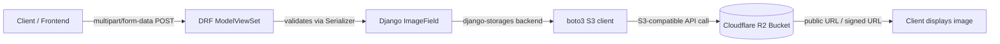
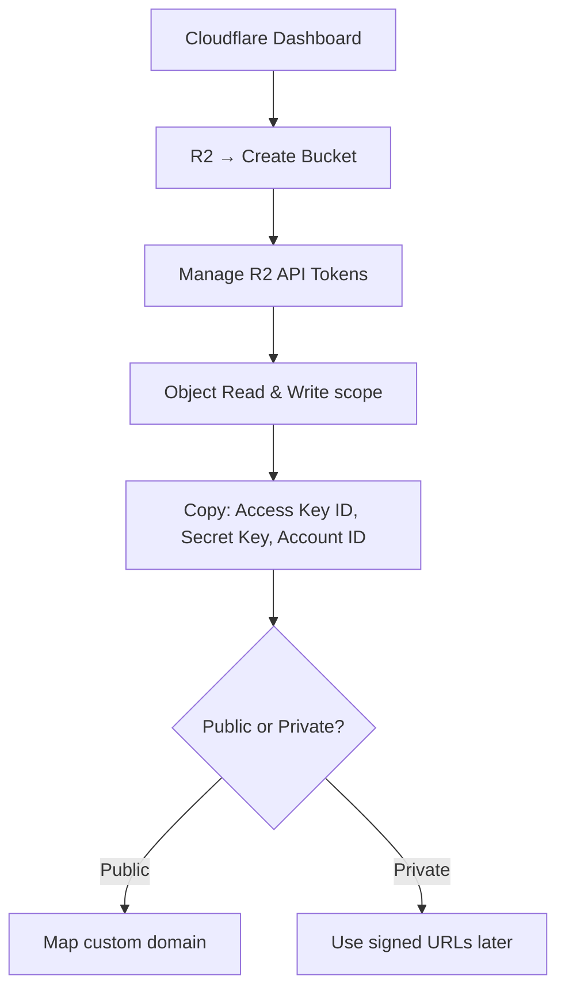
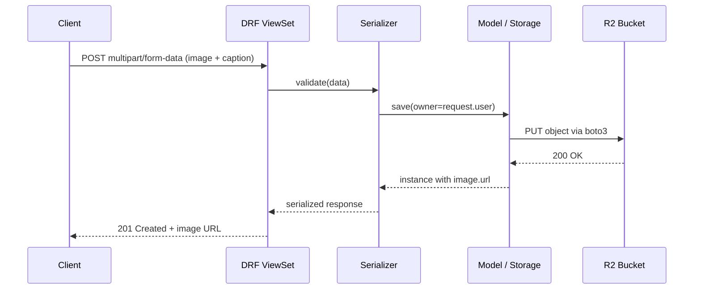
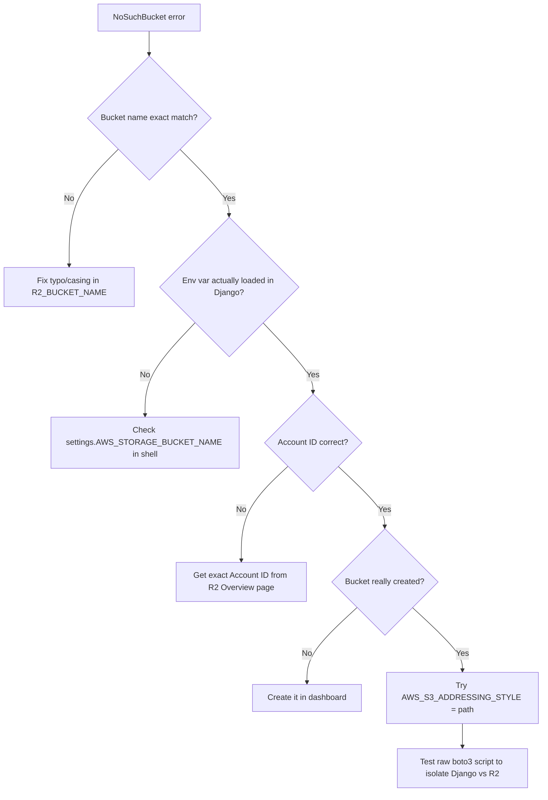

# Cloudflare R2 Image Storage with Django REST Framework

A step-by-step guide to wiring Cloudflare R2 as your media storage backend for a DRF `ModelViewSet` + `DefaultRouter` setup, including the two errors you'll most commonly hit.

---

## Architecture Overview



Django never touches image bytes on local disk — `django-storages` streams the upload straight through boto3 to R2, and the model field stores only the resulting object key/URL.

---

## Step 1 — Create the R2 Bucket and API Token

1. Cloudflare dashboard → **R2** → **Create bucket** (e.g. `my-app-media`).
2. **Manage R2 API Tokens** → create a token scoped to **Object Read & Write** on that bucket.
3. Save these three values somewhere safe:
   - `Access Key ID`
   - `Secret Access Key`
   - `Account ID`
4. Decide: **public bucket** (simple, good for non-sensitive images) or **private bucket** (served via signed URLs).



---

## Step 2 — Install Dependencies

```bash
pip install django-storages boto3 Pillow
```

- `django-storages` — pluggable storage backend abstraction
- `boto3` — AWS SDK; R2 speaks the S3-compatible API
- `Pillow` — required by Django's `ImageField` to validate images

---

## Step 3 — Configure `settings.py`

```python
INSTALLED_APPS = [
    ...
    "storages",
]

AWS_ACCESS_KEY_ID = env("R2_ACCESS_KEY_ID")
AWS_SECRET_ACCESS_KEY = env("R2_SECRET_ACCESS_KEY")
AWS_STORAGE_BUCKET_NAME = env("R2_BUCKET_NAME")
AWS_S3_ENDPOINT_URL = f"https://{env('R2_ACCOUNT_ID')}.r2.cloudflarestorage.com"

AWS_S3_REGION_NAME = "auto"
AWS_S3_SIGNATURE_VERSION = "s3v4"
AWS_S3_ADDRESSING_STYLE = "path"   # more forgiving than "virtual" for R2
AWS_S3_FILE_OVERWRITE = False
AWS_DEFAULT_ACL = None

AWS_S3_CUSTOM_DOMAIN = env("R2_PUBLIC_DOMAIN", default=None)  # e.g. cdn.myapp.com

STORAGES = {
    "default": {"BACKEND": "storages.backends.s3.S3Storage"},
    "staticfiles": {"BACKEND": "django.contrib.staticfiles.storage.StaticFilesStorage"},
}
```

| Setting | Why it matters |
| --- | --- |
| `AWS_S3_ENDPOINT_URL` | Redirects boto3 from real AWS to Cloudflare's servers |
| `AWS_S3_FILE_OVERWRITE` | Prevents silent overwrites of same-named files |
| `AWS_S3_CUSTOM_DOMAIN` | Gives clean CDN-style URLs instead of raw R2 endpoint links |
| `AWS_S3_ADDRESSING_STYLE` | `path` avoids subdomain issues with bucket names |

---

## Step 4 — Model

```python
# images/models.py
from django.db import models

def image_upload_path(instance, filename):
    return f"products/{instance.owner_id}/{filename}"

class ProductImage(models.Model):
    owner = models.ForeignKey("auth.User", on_delete=models.CASCADE)
    image = models.ImageField(upload_to=image_upload_path)
    caption = models.CharField(max_length=255, blank=True)
    created_at = models.DateTimeField(auto_now_add=True)
```

```bash
python manage.py makemigrations
python manage.py migrate
```

---

## Step 5 — Serializer

```python
# images/serializers.py
from rest_framework import serializers
from .models import ProductImage

class ProductImageSerializer(serializers.ModelSerializer):
    class Meta:
        model = ProductImage
        fields = ["id", "owner", "image", "caption", "created_at"]
        read_only_fields = ["id", "owner", "created_at"]
```

---

## Step 6 — ViewSet

```python
# images/views.py
from rest_framework import viewsets, permissions, parsers
from .models import ProductImage
from .serializers import ProductImageSerializer

class ProductImageViewSet(viewsets.ModelViewSet):
    serializer_class = ProductImageSerializer
    permission_classes = [permissions.IsAuthenticated]
    parser_classes = [parsers.MultiPartParser, parsers.FormParser]

    def get_queryset(self):
        return ProductImage.objects.filter(owner=self.request.user)

    def perform_create(self, serializer):
        serializer.save(owner=self.request.user)
```

`parser_classes` is required — without it DRF can't parse `multipart/form-data`, and file uploads silently fail to bind.

---

## Step 7 — URLs with `DefaultRouter`

```python
# images/urls.py
from rest_framework.routers import DefaultRouter
from .views import ProductImageViewSet

router = DefaultRouter()
router.register(r"product-images", ProductImageViewSet, basename="productimage")
urlpatterns = router.urls
```

```python
# project/urls.py
urlpatterns = [
    ...
    path("api/", include("images.urls")),
]
```

`basename` is **required** here because `get_queryset()` is overridden dynamically — DRF can't infer the model from a class-level `queryset` attribute that doesn't exist.

This auto-generates:

| Method | URL | Action |
| --- | --- | --- |
| GET | `/api/product-images/` | list |
| POST | `/api/product-images/` | create (upload) |
| GET | `/api/product-images/{id}/` | retrieve |
| PUT/PATCH | `/api/product-images/{id}/` | update |
| DELETE | `/api/product-images/{id}/` | delete |

---

## Step 8 — Clean Up Orphaned Files on Delete

Django does **not** delete the R2 object when you delete the row. Fix with a signal:

```python
# images/signals.py
from django.db.models.signals import post_delete
from django.dispatch import receiver
from .models import ProductImage

@receiver(post_delete, sender=ProductImage)
def delete_image_file(sender, instance, **kwargs):
    if instance.image:
        instance.image.delete(save=False)
```

```python
# images/apps.py
class ImagesConfig(AppConfig):
    name = "images"
    def ready(self):
        import images.signals  # noqa
```

---

## Step 9 — Test the Upload

```bash
curl -X POST http://localhost:8000/api/product-images/ \
  -H "Authorization: Bearer <token>" \
  -F "image=@/path/to/photo.jpg" \
  -F "caption=Test image"
```

Expect a response like:

```json
{"image": "https://cdn.myapp.com/media/products/1/photo.jpg"}
```

---

## Full Upload Sequence



---

## Troubleshooting

### Error 1 — "Upload a valid image. The file you uploaded was either not an image or a corrupted image."

This is Pillow failing to open the uploaded bytes. It's almost always a **client-side request formatting** issue, not R2 config.

```mermaid
flowchart TD
    A[Error: not an image / corrupted] --> B{Sent as multipart form-data?}
    B -->|No - raw JSON / base64 string| C[Fix: use form-data, not raw JSON]
    B -->|Yes| D{Field type set to File not Text?}
    D -->|No| E[Fix: set field type to File in Postman/client]
    D -->|Yes| F{Pillow installed correctly?}
    F -->|No| G[pip install --upgrade Pillow]
    F -->|Yes| H{HEIC/HEIF from iPhone?}
    H -->|Yes| I[pip install pillow-heif + register_heif_opener]
    H -->|No| J{parser_classes set on ViewSet?}
    J -->|No| K[Add MultiPartParser, FormParser]
    J -->|Yes| L[Verify file locally: Image.open().verify()]
```

| Cause | Fix |
| --- | --- |
| Sent as raw JSON / base64 string instead of multipart | Use `form-data` body type; never `raw` or `x-www-form-urlencoded` |
| Postman field type set to "Text" instead of "File" | Change the key's type dropdown to **File** |
| Missing/broken Pillow install | `pip install --upgrade Pillow` |
| Missing `parser_classes` on ViewSet | Add `[parsers.MultiPartParser, parsers.FormParser]` |
| Corrupted/truncated source file | Verify locally: `Image.open(path).verify()` |
| Mismatched form field name | Confirm form key matches serializer field name exactly |
| iPhone HEIC/HEIF upload | `pip install pillow-heif` + `register_heif_opener()` before any `Image.open()` |

**Correct curl request:**

```bash
curl -X POST http://localhost:8000/api/product-images/ \
  -H "Authorization: Bearer <token>" \
  -F "image=@/path/to/photo.jpg" \
  -F "caption=Test image"
```

**Correct JS/axios request:**

```js
const formData = new FormData();
formData.append("image", fileInputElement.files[0]); // actual File object
formData.append("caption", "Test image");

axios.post("/api/product-images/", formData, {
  headers: { "Content-Type": "multipart/form-data" },
});
```

**Fastest isolation test:** run the curl command with a known-good local JPEG. If it works, the bug is in your client request formatting. If it still fails, it's Pillow/environment or the file itself.

---

### Error 2 — "NoSuchBucket: The specified bucket does not exist"

This means the request **reached R2 successfully** (auth + parsing worked), but boto3 is pointed at a bucket name R2 doesn't recognize.



| Cause | Fix |
| --- | --- |
| Typo/casing mismatch in bucket name | Compare `R2_BUCKET_NAME` character-by-character with the dashboard |
| Env var not loaded in the running process | `python manage.py shell` → check `settings.AWS_STORAGE_BUCKET_NAME` |
| Env var set locally but not in deployment | Set it in your host/container platform's env config too |
| Wrong `R2_ACCOUNT_ID` (different Cloudflare account) | Copy exact Account ID from R2 → Overview sidebar |
| Bucket never actually created | Confirm creation succeeded in the dashboard |
| Addressing style issue with bucket naming | Switch `AWS_S3_ADDRESSING_STYLE` to `"path"` |

**Isolate Django vs. R2/credentials with raw boto3:**

```python
import boto3

s3 = boto3.client(
    "s3",
    endpoint_url="https://<account_id>.r2.cloudflarestorage.com",
    aws_access_key_id="<key>",
    aws_secret_access_key="<secret>",
    region_name="auto",
)
print(s3.list_buckets())
```

- If your bucket doesn't appear → credential/account/bucket-name problem, not Django.
- If it appears here but Django still fails → Django's settings don't match what you just tested; recheck env loading.

---

## Optional: Private Bucket (Signed URLs)

If the bucket is private instead of public:

```python
# remove AWS_S3_CUSTOM_DOMAIN
AWS_QUERYSTRING_AUTH = True        # default; generates signed URLs
AWS_QUERYSTRING_EXPIRE = 3600      # seconds the signed URL stays valid
```

Signed URLs regenerate fresh on every serializer read — transparent to the client, no extra code needed.

## CORS

If the browser uploads directly to R2 or fetches images cross-origin, configure CORS on the bucket: **Cloudflare dashboard → bucket → Settings → CORS Policy** → allow your frontend origin for `GET` (and `PUT`/`POST` for direct presigned uploads).