# Complete SessionAuthentication API in Django REST Framework

A from-scratch guide covering login, cookies, CSRF, protected endpoints, and logout.

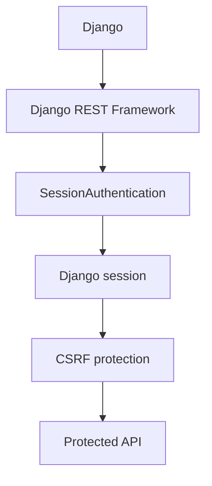

---

## 1. What We Are Building

```text
session_api/
│
├── session_api/
│   ├── settings.py
│   ├── urls.py
│
└── accounts/
    ├── views.py
    ├── urls.py
```

| Endpoint          | Method | Purpose            | Login required |
| ----------------- | ------ | ------------------ | --------------- |
| `/api/login/`     | POST   | Login               | No              |
| `/api/profile/`   | GET    | Get current user    | Yes             |
| `/api/logout/`    | POST   | Logout               | Yes             |
| `/api/protected/` | POST   | Test protected API  | Yes             |

---

## 2. Understand the Architecture First

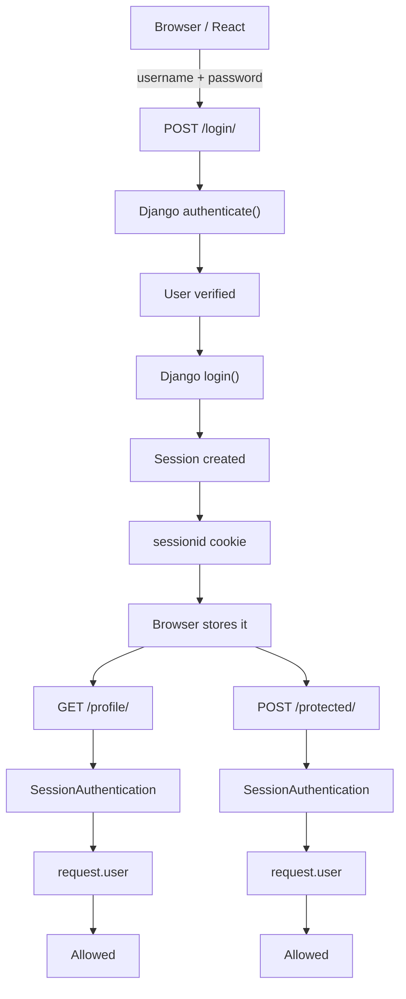

For unsafe requests such as `POST`, `PUT`, `PATCH`, and `DELETE`, **CSRF protection also matters** when using DRF's `SessionAuthentication`.

---

## 3. Create the Project

Create a virtual environment:

```bash
python -m venv venv
```

Activate it.

**macOS/Linux**
```bash
source venv/bin/activate
```

**Windows**
```bash
venv\Scripts\activate
```

Install Django and DRF:

```bash
pip install django djangorestframework
```

Create the project:

```bash
django-admin startproject session_api
cd session_api
```

Create an app:

```bash
python manage.py startapp accounts
```

---

## 4. Configure `settings.py`

Open `session_api/settings.py` and add:

```python
INSTALLED_APPS = [
    'django.contrib.admin',
    'django.contrib.auth',
    'django.contrib.contenttypes',
    'django.contrib.sessions',
    'django.contrib.messages',
    'django.contrib.staticfiles',

    'rest_framework',
    'accounts',
]
```

The important applications are:

```python
'django.contrib.sessions',
'rest_framework',
'accounts',
```

---

## 5. Check Middleware

Make sure these exist:

```python
MIDDLEWARE = [
    'django.middleware.security.SecurityMiddleware',
    'django.contrib.sessions.middleware.SessionMiddleware',
    'django.middleware.common.CommonMiddleware',
    'django.middleware.csrf.CsrfViewMiddleware',
    'django.contrib.auth.middleware.AuthenticationMiddleware',
    'django.contrib.messages.middleware.MessageMiddleware',
    'django.middleware.clickjacking.XFrameOptionsMiddleware',
]
```

These three are especially important:

```python
'django.contrib.sessions.middleware.SessionMiddleware',
'django.middleware.csrf.CsrfViewMiddleware',
'django.contrib.auth.middleware.AuthenticationMiddleware',
```

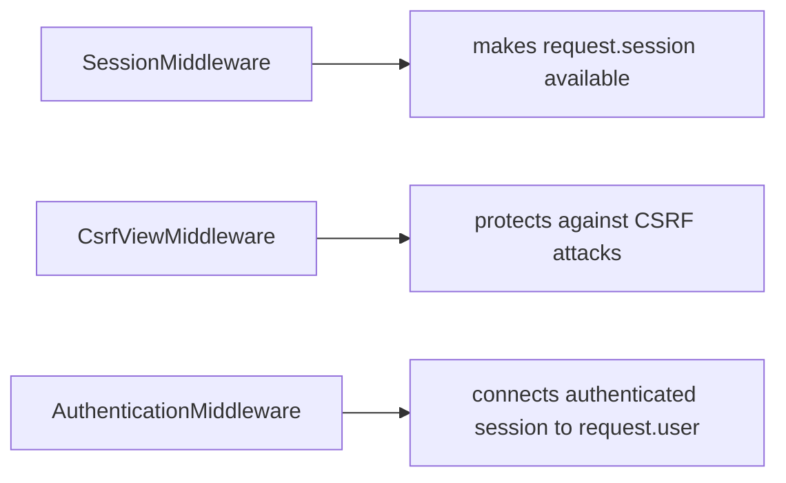

---

## 6. Configure DRF

At the bottom of `settings.py`:

```python
REST_FRAMEWORK = {
    'DEFAULT_AUTHENTICATION_CLASSES': [
        'rest_framework.authentication.SessionAuthentication',
    ],
    'DEFAULT_PERMISSION_CLASSES': [
        'rest_framework.permissions.IsAuthenticated',
    ],
}
```

By default: `DRF → SessionAuthentication → IsAuthenticated`.

---

## 7. Database Setup

```bash
python manage.py migrate
```

Django creates tables including `auth_user` and `django_session`. The important table for this lesson is `django_session`.

---

## 8. Create a User

```bash
python manage.py createsuperuser
```

Example:
```text
Username: bijay
Email: bijay@example.com
Password: ********
```

You now have a real Django user.

---

## 9. Create Login API

Open `accounts/views.py`. Start with a function-based API since it's easier to understand the authentication flow.

```python
from django.contrib.auth import authenticate, login, logout

from rest_framework.decorators import api_view, permission_classes
from rest_framework.permissions import AllowAny, IsAuthenticated
from rest_framework.response import Response
from rest_framework import status


@api_view(['POST'])
@permission_classes([AllowAny])
def login_view(request):

    username = request.data.get('username')
    password = request.data.get('password')

    if not username or not password:
        return Response(
            {'error': 'Username and password are required'},
            status=status.HTTP_400_BAD_REQUEST
        )

    user = authenticate(
        request,
        username=username,
        password=password
    )

    if user is None:
        return Response(
            {'error': 'Invalid username or password'},
            status=status.HTTP_401_UNAUTHORIZED
        )

    login(request, user)

    return Response(
        {
            'message': 'Login successful',
            'user': {
                'id': user.id,
                'username': user.username
            }
        },
        status=status.HTTP_200_OK
    )
```

---

## 10. Understand `authenticate()`

```python
user = authenticate(
    request,
    username=username,
    password=password
)
```

This asks Django: *"Are these credentials valid?"*

If valid, `user` contains the user object (e.g. `user.id` → `7`, `user.username` → `"bijay"`).
If invalid, `user is None`.

---

## 11. Understand `login()`

```python
login(request, user)
```

This establishes the authenticated Django session.

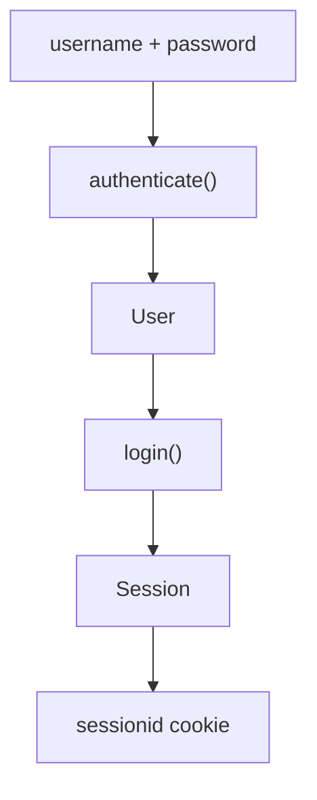

The browser then receives a session cookie, conceptually:

```http
Set-Cookie: sessionid=abc123...
```

The actual session key is generated by Django; don't hard-code one.

---

## 12. Create Profile API

```python
@api_view(['GET'])
@permission_classes([IsAuthenticated])
def profile_view(request):

    return Response({
        'id': request.user.id,
        'username': request.user.username,
        'email': request.user.email,
        'is_authenticated': request.user.is_authenticated
    })
```

Where does `request.user` come from?

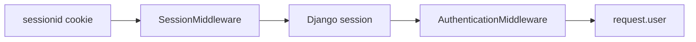

Then DRF's `IsAuthenticated` checks whether the user is authenticated.

---

## 13. Create Logout API

```python
@api_view(['POST'])
@permission_classes([IsAuthenticated])
def logout_view(request):

    logout(request)

    return Response({'message': 'Logout successful'})
```

`logout(request)` ends the authenticated session.

---

## 14. Create a Protected API

```python
@api_view(['POST'])
@permission_classes([IsAuthenticated])
def protected_view(request):

    return Response({
        'message': 'You can access this protected API.',
        'user': request.user.username
    })
```

This endpoint requires authentication.

---

## 15. Complete `views.py`

```python
from django.contrib.auth import authenticate, login, logout

from rest_framework.decorators import api_view, permission_classes
from rest_framework.permissions import AllowAny, IsAuthenticated
from rest_framework.response import Response
from rest_framework import status


@api_view(['POST'])
@permission_classes([AllowAny])
def login_view(request):

    username = request.data.get('username')
    password = request.data.get('password')

    if not username or not password:
        return Response(
            {'error': 'Username and password are required'},
            status=status.HTTP_400_BAD_REQUEST
        )

    user = authenticate(
        request,
        username=username,
        password=password
    )

    if user is None:
        return Response(
            {'error': 'Invalid username or password'},
            status=status.HTTP_401_UNAUTHORIZED
        )

    login(request, user)

    return Response(
        {
            'message': 'Login successful',
            'user': {
                'id': user.id,
                'username': user.username
            }
        }
    )


@api_view(['GET'])
@permission_classes([IsAuthenticated])
def profile_view(request):

    return Response({
        'id': request.user.id,
        'username': request.user.username,
        'email': request.user.email,
        'is_authenticated': request.user.is_authenticated
    })


@api_view(['POST'])
@permission_classes([IsAuthenticated])
def protected_view(request):

    return Response({
        'message': 'You can access this protected API.',
        'user': request.user.username
    })


@api_view(['POST'])
@permission_classes([IsAuthenticated])
def logout_view(request):

    logout(request)

    return Response({'message': 'Logout successful'})
```

---

## 16. Create URLs

Create `accounts/urls.py`:

```python
from django.urls import path

from .views import (
    login_view,
    profile_view,
    protected_view,
    logout_view
)


urlpatterns = [
    path('login/', login_view),
    path('profile/', profile_view),
    path('protected/', protected_view),
    path('logout/', logout_view),
]
```

---

## 17. Main URL

Open `session_api/urls.py`:

```python
from django.contrib import admin
from django.urls import path, include


urlpatterns = [
    path('admin/', admin.site.urls),
    path('api/', include('accounts.urls')),
]
```

Now your API is:

```text
POST /api/login/
GET  /api/profile/
POST /api/protected/
POST /api/logout/
```

---

## 18. Start Django

```bash
python manage.py runserver
```

You'll get `http://127.0.0.1:8000/`.

---

## 19. Test Login

Use Postman, Insomnia, curl, or your frontend.

**Request:** `POST /api/login/`

```json
{
    "username": "bijay",
    "password": "yourpassword"
}
```

If credentials are correct:

```json
{
    "message": "Login successful",
    "user": {
        "id": 1,
        "username": "bijay"
    }
}
```

More importantly, Django sends a session cookie:

```text
sessionid = abc123...
```

---

## 20. What Just Happened?

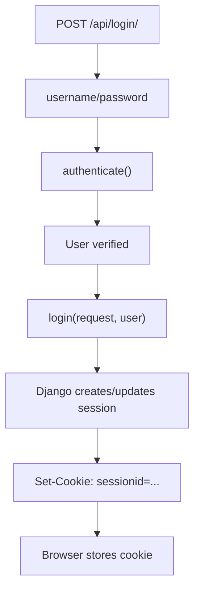

The password is **not** stored in the session cookie.

---

## 21. Now Test `/profile/`

Send: `GET /api/profile/`

If the browser/client sends:

```http
Cookie: sessionid=abc123...
```

then Django can identify the user.

Response:

```json
{
    "id": 1,
    "username": "bijay",
    "email": "bijay@example.com",
    "is_authenticated": true
}
```

---

## 22. What If There Is No Session?

If you call `GET /api/profile/` without logging in, the session doesn't identify an authenticated user. DRF runs `IsAuthenticated` and rejects the request.

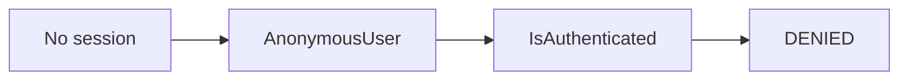

---

## 23. Now the Important Part — CSRF

This is where many DRF beginners get confused. You have `SessionAuthentication` and a `sessionid` cookie. The browser automatically sends cookies, for example:

```http
POST /api/protected/
Cookie: sessionid=abc123...
```

The server therefore needs protection against **Cross-Site Request Forgery (CSRF)**.

---

## 24. What Is CSRF?

Imagine you're logged into `myshop.com`. Your browser has `sessionid=abc123`. Now you visit a malicious website. That website attempts to make your browser send:

```http
POST https://myshop.com/api/orders/
```

Because browsers can automatically attach cookies in applicable contexts, the request could potentially carry your authenticated session.

CSRF protection requires an additional proof that the request originated from a page/application that has access to the CSRF token.

---

## 25. Django's CSRF Model

Django uses a CSRF cookie and a CSRF token.

```text
Browser
│
├── sessionid
│
└── csrftoken
```

For an unsafe request (`POST`, `PUT`, `PATCH`, `DELETE`), the client sends the CSRF token in a request header, commonly:

```http
X-CSRFToken: <token>
```

Django validates it.

---

## 26. GET Usually Doesn't Need CSRF Token

`GET /api/profile/` is considered a safe/read-only HTTP method — you generally don't need to send a CSRF token for it.

But `POST /api/protected/` requires CSRF protection when session authentication is being used.

---

## 27. CSRF Flow

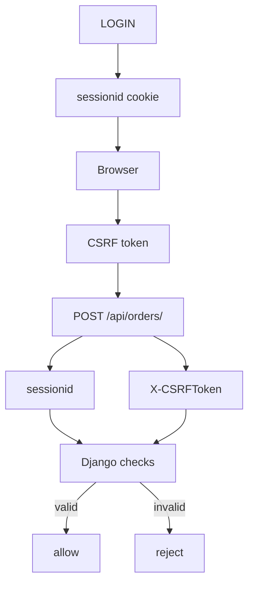

---

## 28. Getting a CSRF Token

For a React frontend, one common approach is to create an endpoint that ensures Django sets the CSRF cookie.

```python
from django.middleware.csrf import get_token

@api_view(['GET'])
@permission_classes([AllowAny])
def csrf_view(request):

    token = get_token(request)

    return Response({'csrfToken': token})
```

URL:

```python
path('csrf/', csrf_view),
```

`GET /api/csrf/` returns:

```json
{
    "csrfToken": "abcxyz..."
}
```

Django also ensures the CSRF cookie is made available.

---

## 29. Important Difference: Session Cookie vs CSRF Cookie

| Cookie | Purpose |
|---|---|
| `sessionid` | Who is logged in? |
| `csrftoken` | Is this state-changing request authorized against CSRF? |

They solve different problems.

---

## 30. React Example

Suppose your React frontend is `http://localhost:3000` and Django is `http://localhost:8000`. You need proper CORS and CSRF configuration for this cross-origin setup.

Install:

```bash
pip install django-cors-headers
```

Add:

```python
INSTALLED_APPS = [
    ...
    'corsheaders',
]
```

Add middleware near the top:

```python
MIDDLEWARE = [
    'corsheaders.middleware.CorsMiddleware',
    'django.middleware.security.SecurityMiddleware',
    ...
]
```

Configure your development frontend:

```python
CORS_ALLOWED_ORIGINS = [
    'http://localhost:3000',
]
```

Because the frontend is making authenticated cookie requests:

```python
CORS_ALLOW_CREDENTIALS = True
```

For CSRF trusted origins:

```python
CSRF_TRUSTED_ORIGINS = [
    'http://localhost:3000',
]
```

The exact origins must match your actual frontend origin.

---

## 31. React Login

First obtain the CSRF cookie/token:

```javascript
await fetch("http://localhost:8000/api/csrf/", {
    credentials: "include"
});
```

Then login:

```javascript
await fetch("http://localhost:8000/api/login/", {
    method: "POST",
    credentials: "include",
    headers: {
        "Content-Type": "application/json",
        "X-CSRFToken": csrfToken
    },
    body: JSON.stringify({
        username: "bijay",
        password: "yourpassword"
    })
});
```

Important: `credentials: "include"` allows the browser to include credentials such as cookies in a cross-origin request when permitted by the server and browser cookie policy.

---

## 32. Calling Protected API (GET)

```javascript
const response = await fetch(
    "http://localhost:8000/api/profile/",
    { credentials: "include" }
);
```

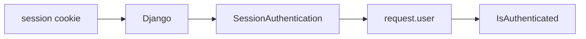

---

## 33. Calling Protected POST API

```javascript
const response = await fetch(
    "http://localhost:8000/api/protected/",
    {
        method: "POST",
        credentials: "include",
        headers: {
            "Content-Type": "application/json",
            "X-CSRFToken": csrfToken
        },
        body: JSON.stringify({})
    }
);
```

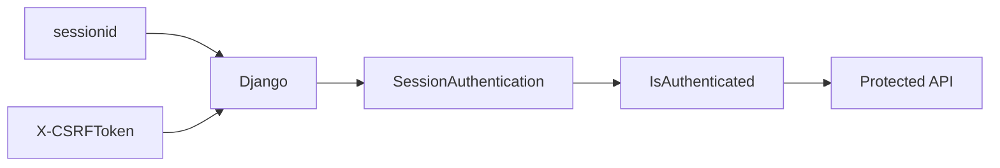

---

## 34. Logout

```javascript
await fetch(
    "http://localhost:8000/api/logout/",
    {
        method: "POST",
        credentials: "include",
        headers: {
            "X-CSRFToken": csrfToken
        }
    }
);
```

Django executes `logout(request)` and the authenticated session is terminated.

---

## 35. Complete Request Lifecycle

**Login**

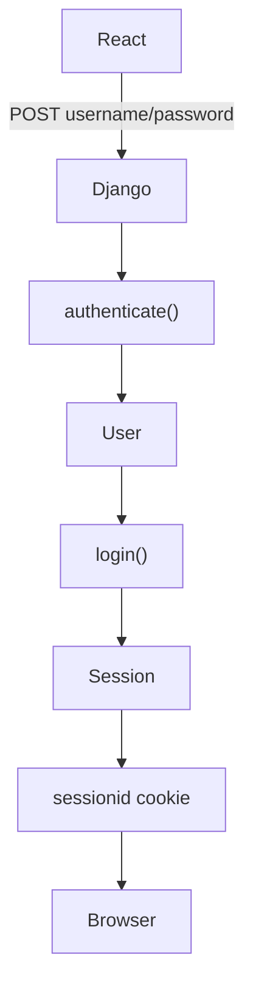

**Protected GET**

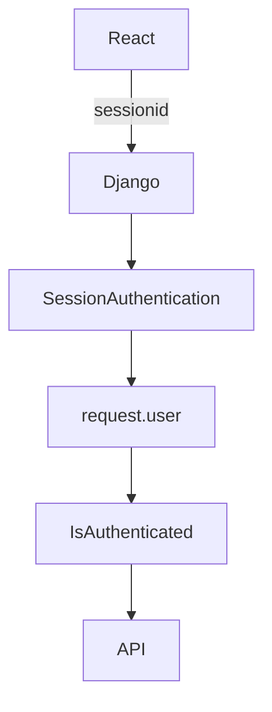

**Protected POST**

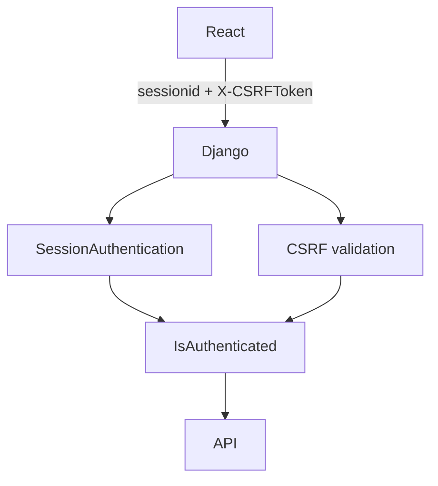

**Logout**

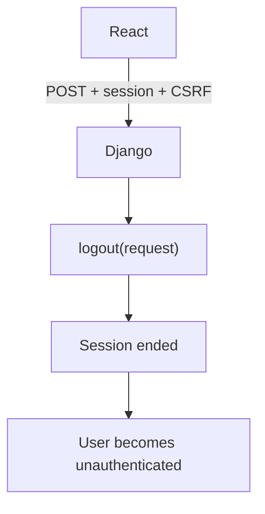

---

## 36. SessionAuthentication in a Class-Based APIView

```python
from rest_framework.views import APIView
from rest_framework.authentication import SessionAuthentication
from rest_framework.permissions import IsAuthenticated
from rest_framework.response import Response


class ProfileAPIView(APIView):

    authentication_classes = [SessionAuthentication]
    permission_classes = [IsAuthenticated]

    def get(self, request):

        return Response({
            'id': request.user.id,
            'username': request.user.username,
            'email': request.user.email
        })
```

Same fundamental process, just class-based.

---

## 37. SessionAuthentication vs `IsAuthenticated`

Don't confuse these two.

**Authentication** — `authentication_classes = [SessionAuthentication]` — asks: *Who is this user?* It establishes identity from the Django session.

**Permission** — `permission_classes = [IsAuthenticated]` — asks: *Is this user allowed to access this endpoint?*

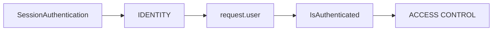

---

## 38. Global Configuration

Instead of repeating this on every view, configure it globally:

```python
REST_FRAMEWORK = {
    'DEFAULT_AUTHENTICATION_CLASSES': [
        'rest_framework.authentication.SessionAuthentication',
    ],
    'DEFAULT_PERMISSION_CLASSES': [
        'rest_framework.permissions.IsAuthenticated',
    ],
}
```

Then your view can simply be:

```python
class ProfileAPIView(APIView):

    def get(self, request):

        return Response({'username': request.user.username})
```

---

## 39. But Login Must Be Public

If `DEFAULT_PERMISSION_CLASSES` is `IsAuthenticated`, then `/login/` would also require authentication unless overridden — that's why we use `@permission_classes([AllowAny])` for login.

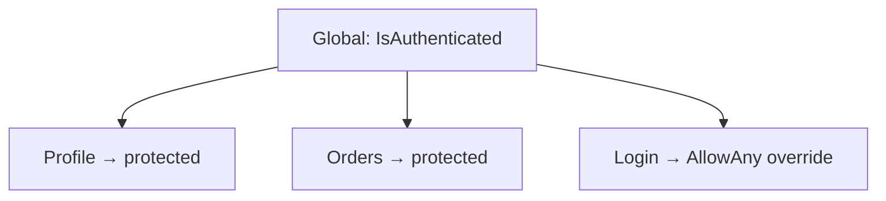

---

## 40. What Happens If CSRF Is Wrong?

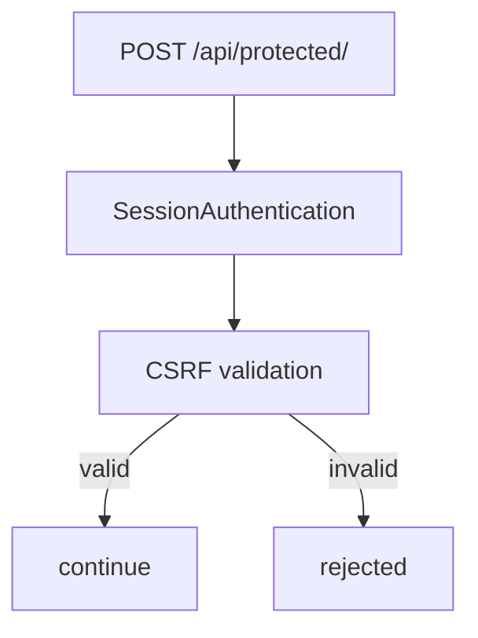

A common error looks like:

```text
CSRF Failed: CSRF token missing.
```

This is **not the same thing** as an invalid username/password.

---

## 41. Common Beginner Mistakes

**Mistake 1 — Forgetting `credentials`**

`fetch(url)` may not send cookies for a cross-origin request. Use `fetch(url, { credentials: "include" })` when your cross-origin cookie setup requires it.

**Mistake 2 — Sending only the session cookie**

For `GET`, that's generally sufficient. For `POST`, `PUT`, `PATCH`, `DELETE` with SessionAuthentication, you also need proper CSRF handling.

**Mistake 3 — Disabling CSRF**

Some tutorials suggest `@csrf_exempt` or other ways to bypass CSRF. Don't use that as the normal solution for a session-authenticated production API — understand why CSRF exists and configure the frontend/backend correctly.

**Mistake 4 — Thinking SessionAuthentication Uses JWT**

It doesn't:

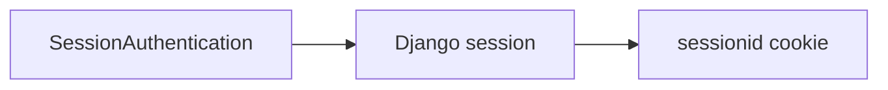

JWT is a different authentication mechanism.

**Mistake 5 — Putting Password in Session**

Never do:

```python
request.session['password'] = password
```

The session does not need the user's password — Django's authentication system handles passwords separately.

**Mistake 6 — Thinking `request.user` Comes From the Frontend**

React doesn't send `{"user": "bijay"}` and have Django simply trust it. Instead:

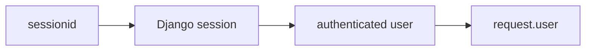

The server determines the authenticated identity.

---

## 42. Final Project Structure

```text
session_api/
│
├── manage.py
│
├── session_api/
│   ├── __init__.py
│   ├── settings.py
│   ├── urls.py
│   ├── asgi.py
│   └── wsgi.py
│
└── accounts/
    ├── __init__.py
    ├── admin.py
    ├── apps.py
    ├── models.py
    ├── urls.py
    ├── views.py
    └── migrations/
```

---

## 43. The Complete Mental Model

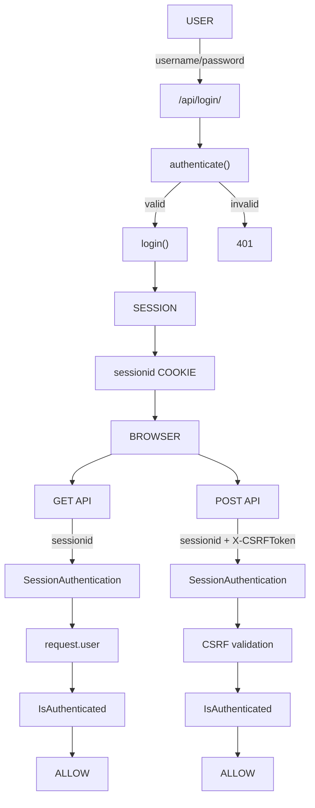

### What you should remember

- **`SessionAuthentication`** → identifies the user using Django's session.
- **`sessionid`** → connects the browser to the server-side authenticated session.
- **`request.user`** → gives you the authenticated Django user.
- **`IsAuthenticated`** → protects the endpoint.
- **`X-CSRFToken`** → protects cookie-authenticated state-changing requests from CSRF.
- **`logout(request)`** → ends the authenticated session.

---

## Your Next DRF Progression

Now that you understand the mechanics, the natural next exercise is to implement this using a `ModelViewSet` Order/Category project:

```mermaid
flowchart TD
    A["SessionAuthentication"] --> B["Login"]
    B --> C["Protected ModelViewSet"]
    C --> D["IsAuthenticated"]
    D --> E["Custom Permission"]
    E --> F["Admin vs normal user"]
    F --> G["Object-level permissions"]
```

That leads directly into the **Permissions** topic that follows Authentication.